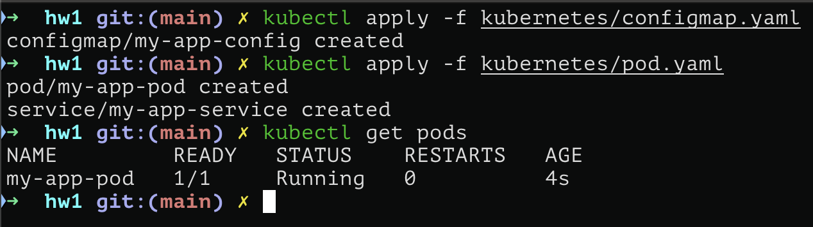
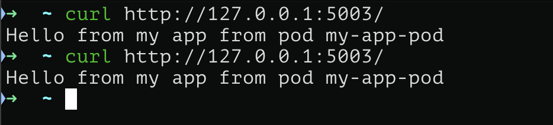
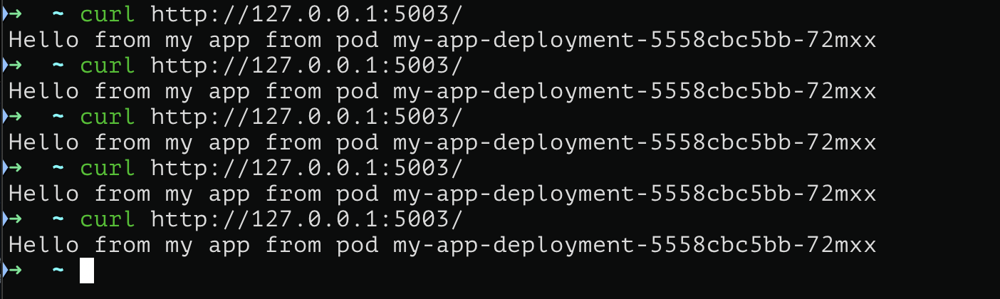
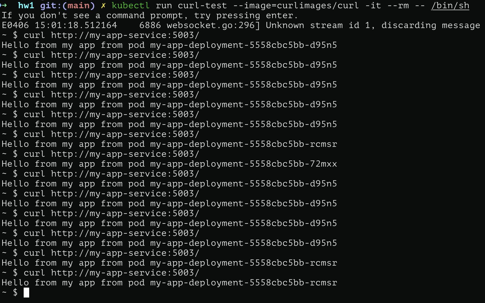
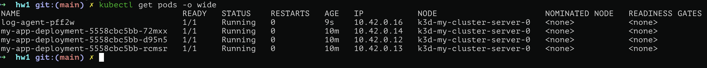
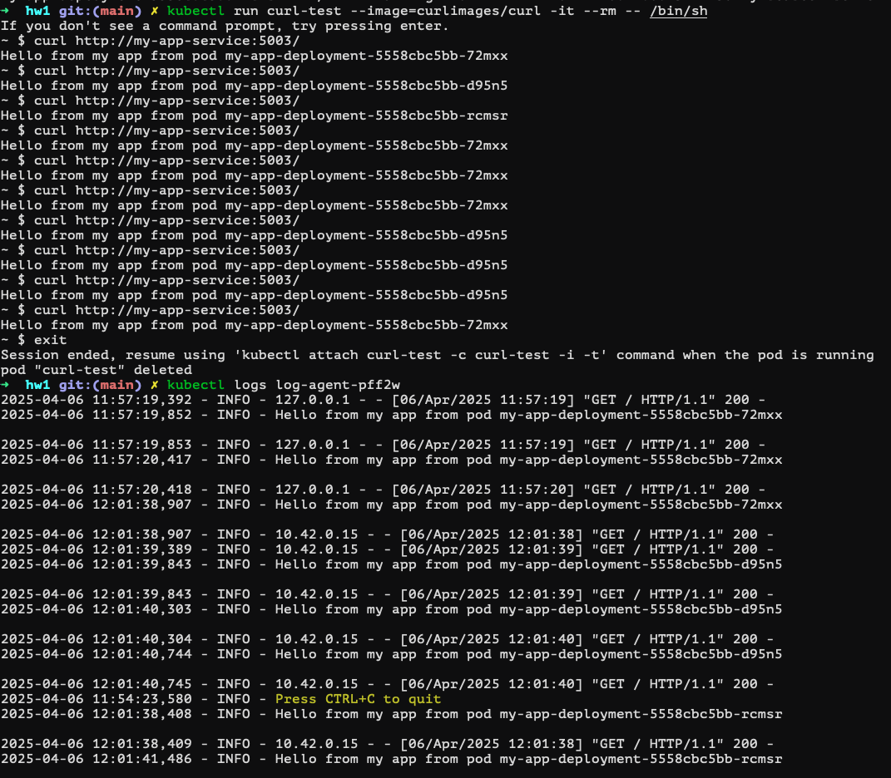
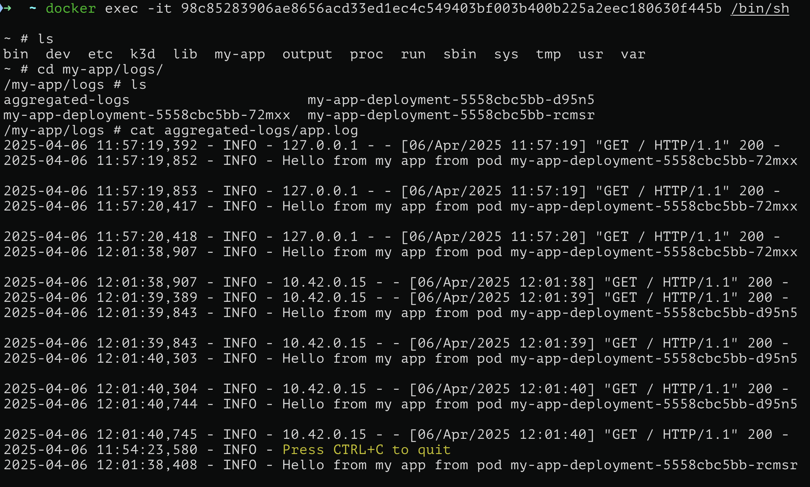
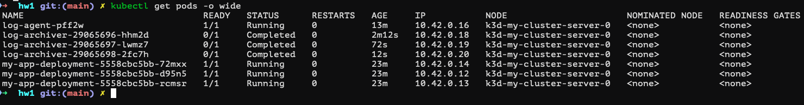

# Развёртывание распределённой системы логирования и хранения с резервным копированием

## 0. Создадим кластер Kubernetes на котором впоследствии будем поднимать поды

Для создания docker образа приложения с именем `my-app-img` используем команду
```sh
docker build -f docker/Dockerfile -t my-app-img .
```

После чего создадим кластер Kubernetes с именем `my-cluster` с 1 нодой. Для этого будем использовать k3d:
```sh
k3d cluster create my-cluster && k3d image import my-app-img --cluster my-cluster
```

## 1. Создадим простое приложение на Python

Код приложения находится [тут](my-app/app).

Это простое приложение на Flask, реализующее API

- `GET /` — возвращает строку `"Welcome to the custom app"`
- `GET /status` — возвращает JSON `{"status": "ok"}`
- `POST /log` — принимает JSON `{"message": "some log"}` и записывает его в файл `/app/logs/app.log`
- `GET /logs` — возвращает содержимое файла `/app/logs/app.log`

Логгирование происходит с помощью библиотеки `logging`.

## 2. Развертка пода для тестирования

Манифест для развертки пода находится [тут](kubernetes/pod.yaml). На поде поднимается контейнер с переменными окружения из [configmap](kubernetes/configmap.yaml). Проверим, что под поднялся



Проверим, что под отвечает на запросы




## 3. Развертка приложения как Deployment

Манифест для развертки деплоймента находится [тут](kubernetes/app_deployment.yaml). Укажем `replicas: 3` для реплицирования. Проверим что деплоймент поднялся


Проверим, что деплоймент отвечает на запросы




## 4. Создание Service для балансировки нагрузки

В указанном выше [деплойменте](kubernetes/app_deployment.yaml) уже есть Service, его код не меняется. Проверим, что балансировка работает. Для этого создадим вспомогательный под с утилитой `curl` и поотправлям запросы на Service

```bash
kubectl run curl-test --image=curlimages/curl -it --rm -- /bin/sh
curl http://my-app-service:5003/
```



## 5. Развертка DaemonSet с log агентом

Манифест для развертки DaemonSet находится [тут](kubernetes/daemon_set.yaml). Поды записывают логи в папки, связанные с папками на ноде (через HostPath). log агент создает процессы, которые мониторят все папки с логами и при добавлении в любую из папок нового лога, транслирует его в аггрегированный файл с логами. Происходит это с помощью команды
```bash
for logfile in /logs/*/app.log;
do tail -F \"$logfile\" | tee -a /logs/aggregated-logs/app.log &
done;
wait
```

Аналогично прошлому пункту создадим вспомогательный под и будем отправлять запросы, распределяющиеся на разные поды. В аггрегированном логе содержится полная информация, причем она не дублируется. Проверим, что log агент поднялся



Проверим, что логи сохраняются в логи пода Kubernetes



Проверим, что логи сохраняются в директорию на ноде



(На фото влезли не все `curl` запросы)

## 6. Развертка CronJob

Манифест для развертки CronJob находится [тут](kubernetes/cron_job.yaml). Каждые 10 минут будет подниматься под и выполнять следующую последовательность команд

```bash
timestamp=$(date +%Y%m%d%H%M%S);
cp /my-app/logs/aggregated-logs/app.log /tmp/app.log; # копирование аггрегированных логов в временную папку (для корректности архивирования при одновременной записи исходный файл)
tar -czf /log-archives/app-logs-${timestamp}.tar.gz -C /tmp app.log; # архивирование аггрегированных логов
rm /tmp/app.log; # удаление скопированных аггрегированных логов
echo "Create archive: /log-archives/app-logs-${timestamp}.tar.gz"; # уведомление об окончании процесса
```

Для работы под использует два volume на ноду типа HostPath. Таким образом вся информация остается на ноде после завершения работы пода с CronJob. Проверим, что CronJob работает. Для быстрого тестирования уменьшим интервал до 1 минуты. Проверим, что Cron поднялся



Проверим, что Cron работает


Проверим, что архивы сохраняются на ноде


## 7. Создание единого bash-скрипта для развертки всей системы

Скрипт находится [тут](run.sh). Запуск можно произвести с помощью

```bash
bash run.sh
```

или с помощью [Makefile](Makefile) просто нажав setup.
