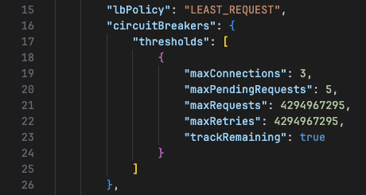
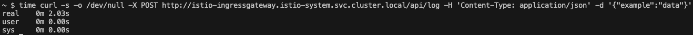
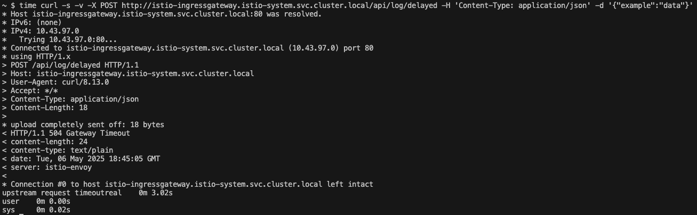

# Добавление Istio в существующую Kubernetes-систему

## 0. Установка и настройка Istio Gateway

Поменяем неймспейс с дефолтного `default` на `space-with-istio`, чтобы было интереснее. Добавим его во все манифесты, чтобы ресурсы создавались в `space-with-istio`.

**Установка.**

```bash
curl -L https://istio.io/downloadIstio | sh -
cd istio-1.25.2 && export PATH=$PWD/bin:$PATH && cd ../

k3d cluster create my-cluster && k3d image import my-app-img --cluster my-cluster
kubectl create namespace space-with-istio
istioctl install --set profile=default -y
kubectl label namespace space-with-istio istio-injection=enabled
```

**Поднимаем существующие поды.**

```sh
kubectl apply -f kubernetes/configmap.yaml
kubectl apply -f kubernetes/app_deployment.yaml
```

Проверим, что поды создались в новом неймспейсе

```bash
kubectl get deployments -n space-with-istio
kubectl get pods -n space-with-istio
```


## 1.Настройка Istio Gateway и маршрутов в VirtualService

Создадим объект `Gateway`

```yaml
apiVersion: networking.istio.io/v1beta1
kind: Gateway
metadata:
  name: my-gateway
  namespace: space-with-istio # новый неймспейс
spec:
  selector:
    istio: ingressgateway
  servers:
  - port:
      number: 80
      name: http
      protocol: HTTP
    hosts:
    - "*" # все хосты
```

и `VirtualService`

```yaml
apiVersion: networking.istio.io/v1beta1
kind: VirtualService
metadata:
  name: my-virtualservice
  namespace: space-with-istio
spec:
  hosts:
    - "*"
  gateways:
    - my-gateway
  http:
    - match:
        - uri:
            prefix: "/api"
      route:
        - destination:
            host: my-app-service.space-with-istio.svc.cluster.local
            port:
              number: 5003
    - match:
        - uri:
            prefix: "/" # url не имеющие префикс "api" считаем неверными и возвращаем 404
      directResponse:
        status: 404
        body:
          string: "Not Found"
```

Проверим, что все работает. Создадим вспомогательный под с curl-контейнером

```sh
kubectl run curl-test --image=curlimages/curl -it --rm -- /bin/sh
```

и попробуем дойти до нашего приложения через гейтвей. Для этого выполним curl запросы

```sh
curl -v http://istio-ingressgateway.istio-system.svc.cluster.local/api
curl -v http://istio-ingressgateway.istio-system.svc.cluster.local/wrong
```


## 2. Настройка DestinationRule.

Для сервиса нашего приложения (my-app-service) настроим DestinationRule.

```yaml
apiVersion: networking.istio.io/v1beta1
kind: DestinationRule
metadata:
  name: my-app-service-destination
  namespace: space-with-istio
spec:
  host: my-app-service.space-with-istio.svc.cluster.local
  trafficPolicy:
    tls:
      mode: ISTIO_MUTUAL
    loadBalancer:
      simple: LEAST_CONN
      # https://istio.io/latest/docs/reference/config/networking/destination-rule/#LoadBalancerSettings-SimpleLB-LEAST_CONN алгоритм помечен как deprecated
      # Написано, что вместо него стоит использовать LEAST_REQUEST, который и устанавливается, даже если указать LEAST_CONN
    connectionPool:
      tcp:
        maxConnections: 3
      http:
        http1MaxPendingRequests: 5
        maxRequestsPerConnection: 1
```

Проверим, что все применилось. Конфигурацию сервиса можно посмотреть следующей командой

```sh
kubectl get svc -n istio-system
istioctl proxy-config clusters istio-ingressgateway-6d8d69dd75-mt9cj.istio-system --port 5003 -o json
```

Конфигурационные файлы до и после.



Видим, что в файле "после" применились наши параметры на количества соединений, а также стоит алгоритм балансировки `LEAST_REQUEST` (в [документации](https://istio.io/latest/docs/reference/config/networking/destination-rule/#LoadBalancerSettings-SimpleLB-LEAST_CONN) алгоритм помечен как deprecated Написано, что вместо него стоит использовать LEAST_REQUEST, который и устанавливается, даже если указать LEAST_CONN).

## 4. Настройка отказоустойчивости и политики доставки.

Модифицируем VirtualService, добавив необходимые параметры

```yaml
...
  http:
    - match:
        - uri:
            prefix: "/api/log"
      route:
        - destination:
            host: my-app-service.space-with-istio.svc.cluster.local
            port:
              number: 5003
      fault:
        delay:
          fixedDelay: 2s
          percentage:
            value: 100
      timeout: 1s
      retries:
        attempts: 2
        perTryTimeout: 1s
    - match:
        - uri:
            prefix: "/api"
...
```

Проверим, что задержка работает с помощью `time`

```sh
time curl -s -o /dev/null -X POST http://istio-ingressgateway.istio-system.svc.cluster.local/api/log -H 'Content-Type: application/json' -d '{"example":"data"}'
```



и что работает таймаут. Для этого вызовем специальную фукнцию со слипом в 5 секунд

```python
@app.route("/api/log/delayed", methods=["POST"])
def sleep():
    time.sleep(5)
    return f"Slept for 5 seconds"
```

```sh
time curl -s -v -X POST http://istio-ingressgateway.istio-system.svc.cluster.local/api/log/delayed -H 'Content-Type: application/json' -d '{"example":"data"}'
```



Видим, что задержка в 2 секунды просуммировалась с 1 секундой таймаута и мы получили ошибку `504 Gateway Timeout`.

## 5. Создание единого bash-скрипта для развертки всей системы

Скрипт находится [тут](run.sh). Запуск можно произвести с помощью

```bash
bash run.sh
```

или с помощью [Makefile](Makefile) просто нажав setup.
