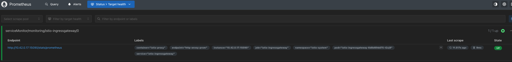
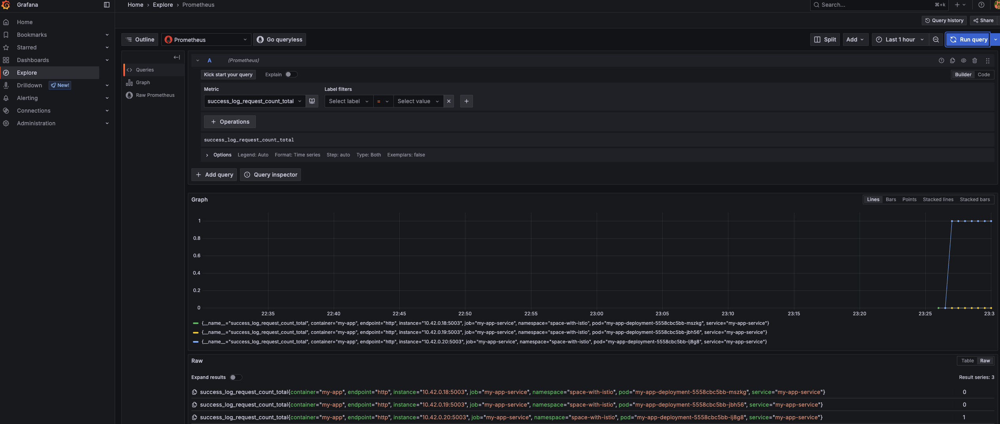

# Добавление мониторинга через Prometheus.

## 0. Установка Prometheus.

Установим с помощью Helm-чарта

```sh
helm repo add prometheus-community https://prometheus-community.github.io/helm-charts
helm repo update
helm install prometheus prometheus-community/kube-prometheus-stack --namespace monitoring --create-namespace
```

## 1. Настройка Prometheus для сбора метрик с Istio.

Пропатчим сервис Istio ingressgateway, чтобы он отвечал с порта 15090 прометеусу

```sh
kubectl -n istio-system patch svc istio-ingressgateway --type='json' -p '[{"op":"add","path":"/spec/ports/-","value":{"name":"http-envoy-prom","protocol":"TCP","port":15090,"targetPort":15090}}]'
```

Создадим ServiceMonitor, чтобы Prometeus "увидел" Istio

```yaml
apiVersion: monitoring.coreos.com/v1
kind: ServiceMonitor
metadata:
  name: istio-ingressgateway
  namespace: monitoring
  labels:
    release: prometheus
spec:
  selector:
    matchLabels:
      istio: ingressgateway
  namespaceSelector:
    matchNames:
    - istio-system
  endpoints:
  - port: http-envoy-prom
    path: /stats/prometheus
    interval: 15s
```

Пробросим порт

```sh
kubectl --namespace monitoring port-forward svc/prometheus-kube-prometheus-prometheus 9090
```

и во вкладке Status/Target health видим ServiceMonitor с нашим Istio inrgessgateway.



Создадим curl-под и сделаем несколько запросов. Зайдем в Grafana и проверим, что соответствующие метрики прокрасились.

```sh
kubectl get secret -n monitoring prometheus-grafana -o jsonpath="{.data.admin-password}" | base64 --decode && echo # пароль
```


## 2. Добавление метрик в пользовательское приложение.

Добавим метрики в наше Python приложение. Будем использовать библиотеку `prometheus_client`.

```python
from prometheus_client import Counter, Histogram, generate_latest, CONTENT_TYPE_LATEST

LOG_REQUEST_COUNT = Counter("log_request_count", "Total number of api/log requests")
SUCCESS_LOG_REQUEST_COUNT = Counter("success_log_request_count", "Total number of successful api/log requests")
FAILED_LOG_REQUEST_COUNT = Counter("failed_log_request_count", "Total number of failed api/log requests")
LOG_REQUEST_DURATION = Histogram("log_request_duration_milliseconds", "Duration of api/log requests")
```

И будем обновлять их в нужных ситуациях:

```python
@app.route("/api/log/delayed", methods=["POST"])
def log_message_delayed():
    LOG_REQUEST_COUNT.inc()

    delay = random.randint(1, 5)
    start_time = time.time()
    time.sleep(delay)
    LOG_REQUEST_DURATION.observe(time.time() - start_time)

    if random.random() < 0.3:
        FAILED_LOG_REQUEST_COUNT.inc()
        return jsonify({"state": "failed"}), 500
    
    SUCCESS_LOG_REQUEST_COUNT.inc()
    return jsonify({"state": "success"}), 200
```

## 3. Настройка Prometheus для сбора метрик с приложения.

Добавим ServiceMonitor для нашего приложение, чтобы Prometeus обнаружило его. Укажем, что метрики надо собирать с адреса `/metrics`.

```yaml
apiVersion: monitoring.coreos.com/v1
kind: ServiceMonitor
metadata:
  name: my-app-servicemonitor
  namespace: monitoring
  labels:
    release: prometheus
spec:
  selector:
    matchLabels:
      app: my-app
  namespaceSelector:
    matchNames:
      - space-with-istio
  endpoints:
    - port: http
      path: /metrics
      interval: 15s
```

Проверим, что Prometeus видит наше приложение.


И что в Графане наши метрики отображаются




## 4. Создание единого bash-скрипта для развертки всей системы

Скрипт находится [тут](run.sh). Запуск можно произвести с помощью

```bash
bash run.sh
```

или с помощью [Makefile](Makefile) просто нажав setup.
